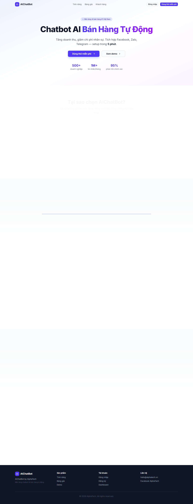
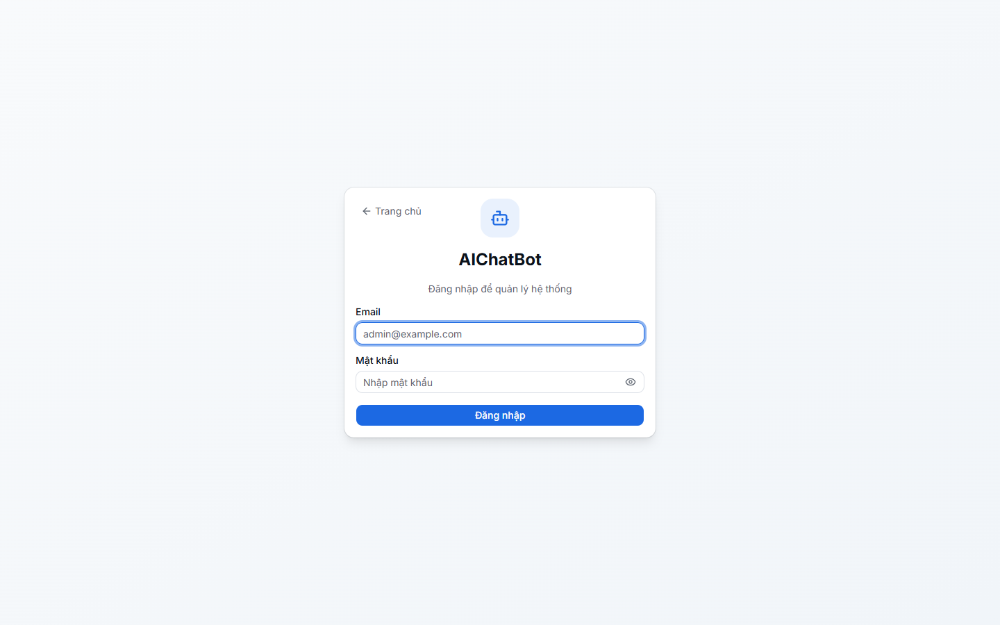
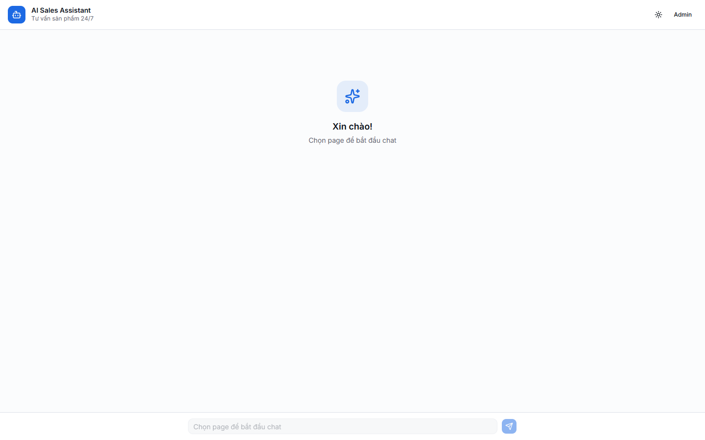
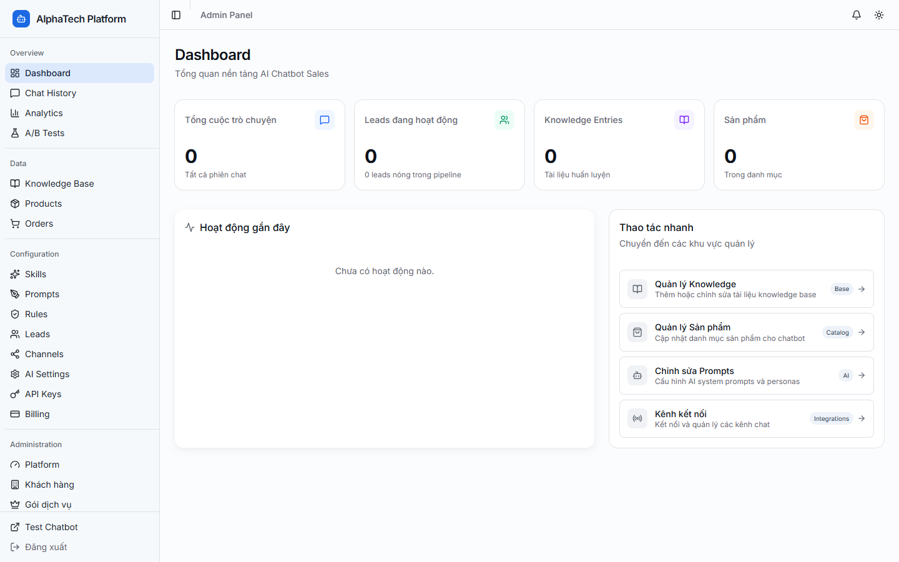
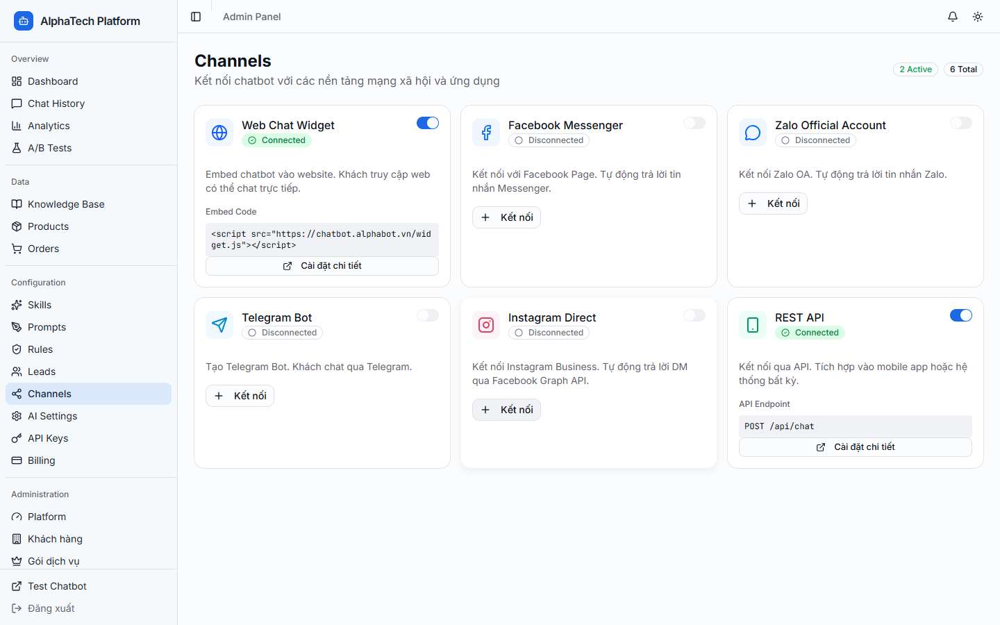

# AIChatbot

  

  <strong>Nen tang AI sales giup bien he thong chat thanh mot bo may van hanh kinh doanh thuc su.</strong>

  AIChatbot giup doanh nghiep tra loi nhanh hon, tu van san pham tot hon,
  thu lead som hon, va quan ly toan bo van hanh tu mot lop admin duy nhat.

  
  
  
  

  <a href="README.md"><strong>Read in English</strong></a> |
  <strong>Doc bang tieng Viet</strong>

  <a href="https://chatbot.alphabot.vn/"><strong>Live Site</strong></a>
  |
  <a href="SUPPORT.md"><strong>Ho Tro</strong></a>
  |
  <a href="docs/FAQ.md"><strong>FAQ</strong></a>

## Cu Chuyen Lon

Phan lon cong cu chat ban hang hien nay van gap dung mot diem:

- Tin nhan den tu qua nhieu kenh,
- Nhan vien phai tra loi lai cung mot loai cau hoi,
- Thong tin san pham de bi lech va mat dong bo,
- Lead bi thu qua muon hoac khong duoc thu dung luc,
- Doi van hanh mat tam nhin toan bo funnel.

AIChatbot doi luong do.

No ket hop lop AI chat huong khach hang, mot he thong da kenh, va mot workspace admin cho san pham, knowledge, prompts, rules, leads, analytics, billing, va quan ly kenh.

Diem "wow" khong chi la bot co the tra loi.
Diem "wow" la chat, du lieu san pham, workflow lead, va admin control duoc thiet ke nhu mot he thong thong nhat.

> Tu nhung hop thu chat roi rac thanh mot lop van hanh AI sales co cau truc.

## Vi Sao Trai Nghiem Nay Khac

1. **Ket Noi** nhieu kenh khach hang vao cung mot he thong.
2. **Huong Dan** hoi dap san pham va hoi thoai ban hang bang AI ket hop du lieu thuc.
3. **Van Hanh** doanh nghiep tu workspace admin thay vi chat chaos.

Repository nay la hub public de gioi thieu san pham va ho tro cho AIChatbot. No khong chua source code cua ung dung.

## Ban Nhan Duoc Gi

- `AI Sales Assistant` cho product Q&A, tu van va goi y
- `Multi-channel Reach` qua web chat, Facebook, Zalo, Telegram va API
- `Lead Workflow` cho capture, scoring, routing va follow-up
- `Admin Control` cho products, knowledge, prompts, rules, channels, billing, analytics va team
- `SaaS Shape` voi signup, onboarding va mo hinh to chuc tach biet

## Nhin Nhanh

- Nen tang web hosted
- Lop public cho marketing va live chat
- Dashboard admin co xac thuc
- Product catalog va knowledge base
- Prompt, rules va quan ly channel
- Lead, order va analytics workflow

## Xem Nhanh Giao Dien

  
  
  

  
  

## Danh Cho Ai

- Ecommerce teams xu ly nhieu cau hoi san pham lap lai moi ngay
- Sales teams muon tang toc do phan hoi ma khong phai tang nguoi tuong ung
- Doi van hanh can lien ket chat, lead va catalog chat hon
- Doanh nghiep muon co mot lop AI thong nhat tren nhieu kenh

## AIChatbot Lam Duoc Gi

- Cung cap mot marketing site va live chat surface
- Ho tro account login, onboarding va workflow to chuc
- Cung cap AI chat experience cho assisted selling
- Mo ra he thong admin cho products, knowledge, prompts, rules, channels, leads, analytics, billing va team
- Noi hoi thoai khach hang voi workflow van hanh huong doanh thu

## Vi Sao San Pham Nay Ton Tai

AIChatbot khong chi la mot chatbot widget.

No ton tai de giai bai toan thuc te hon:

> "Doanh nghiep can AI de ban hang va ho tro trong hoi thoai thuc, nhung dong thoi can kiem soat products, knowledge, leads va channels o phia admin."

Vi vay san pham nay giong mot lop van hanh hon la chi mot cua so chat.

## Vi Sao Nguoi Dung Nho No

- Vi no bien AI chat thanh business workflow thay vi gimmick
- Vi operator giu prompt va product control sat hon voi thuc te
- Vi sales team co duong di ro hon tu conversation sang lead
- Vi multi-channel chat tro nen co to chuc thay vi roi rac

## Pham Vi San Pham

### Da Co San

- Hosted marketing site
- Login va account flow
- Live chat surface
- Admin dashboard
- Knowledge, products, prompts, rules, leads, channels, analytics va billing pages
- Multi-role admin model

### Luu Y Quan Trong

- AIChatbot khong phai chatbot framework open-source
- Repository nay khong phai repo source hay repo deploy
- Mot so nang luc phu thuoc vao integrations, data va provider configuration
- Chat luong sales van phu thuoc vao viec duy tri products, prompts va rules

## Mo Hinh Rieng Tu

AIChatbot la mot san pham web hosted theo kieu SaaS.

Hanh vi du lieu o muc high-level:

- Khach public co the browse site va dung cac trai nghiem chat cong khai duoc bat
- Admin da dang nhap co the quan ly du lieu theo role duoc gan
- Chat, leads, catalog va analytics co the duoc luu tren server de van hanh san pham
- Provider AI ben ngoai co the xu ly prompts va content tuy theo cau hinh dang dung

Xem [docs/PRIVACY.md](docs/PRIVACY.md) de doc ban privacy tom tat.

## Cac Be Mat San Pham

- Public marketing layer: homepage, pricing, signup, login
- Chat layer: AI-assisted customer conversation
- Admin layer: dashboard, products, knowledge, prompts, rules, channels, leads, analytics, billing, team

## Availability

- Public site: https://chatbot.alphabot.vn/
- Product type: hosted AI sales platform
- Current state: public-facing product with authenticated admin workspace

## Bat Dau Trong 3 Buoc

1. **Browse** site live de hieu positioning va trai nghiem public.
2. **Explore** screenshot va docs trong repo de thay admin va operations side.
3. **Contact** support neu can hoi ve san pham, deployment hay nhu cau van hanh.

## Bat Dau Tu Day

- `Live site`: https://chatbot.alphabot.vn/
- `Ho Tro`: [SUPPORT.md](SUPPORT.md)
- `FAQ`: [docs/FAQ.md](docs/FAQ.md)
- `Roadmap`: [docs/ROADMAP.md](docs/ROADMAP.md)

## Ho Tro

- Email: `admin@alphabot.vn`

## Kham Pha AIChatbot

  <strong>Muon xem cach AI chat, product control, va sales operations nam chung trong mot nen tang?</strong> 
  Hay vao live site truoc, sau do dung support path neu can hoi them ve san pham hoac deployment.

  <a href="https://chatbot.alphabot.vn/"><strong>Mo Live Site</strong></a>
  |
  <a href="SUPPORT.md"><strong>Lien He Ho Tro</strong></a>

## Luu Y Closed-Source

AIChatbot la san pham commercial closed-source cua AlphaTech / AlphaBot.

Repository nay ton tai de:

- giai thich san pham
- cho thay nang luc hien tai
- cong bo screenshot va tai lieu public
- cung cap dau moi support va security contact

No khong bao gom:

- application source code
- private backend hoac deployment code
- admin credentials
- secret infrastructure hoac keys
- customer conversation data

## Pham Vi Repository

Repo nay chi nen chua:

- product overview
- FAQ
- privacy summary
- roadmap
- support va security contacts
- screenshots

Neu sau nay co public documentation site hoac release flow rieng, phan do nen duoc document ro rang thay vi de nguoi xem tu suy dien tu repo nay.
